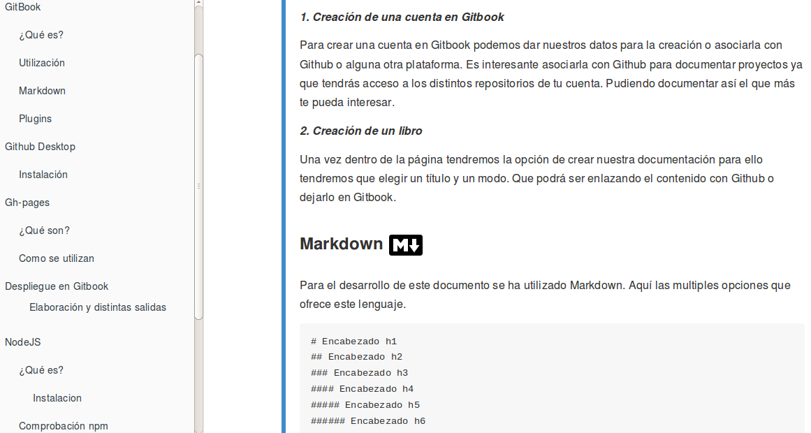

# Tareas-Iniciales-EricLucasTania

  
## Descripción de la práctica.

El objetivo de esta práctica es familiarizarnos con el entorno de **Gitbook** así como los plugins, y las distintas 
opciones que ofrece esta plataforma. Para ello hemos partido de un repositorio de ayuda, que hemos moldeado a nuestro
gusto dándonos como resultado el siguiente [**documento gitbook**](ULL-ESIT-SYTW-1617.github.io/tareas-iniciales-ericlucastania).

## Enlaces interesantes 
 
[Gitbook gh-pages](ULL-ESIT-SYTW-1617.github.io/tareas-iniciales-ericlucastania).

[Gitbook página oficial](https://www.gitbook.com/book/alu0100786330/tareasini/details).

## Datos de partida

* [Repositorio Inicial](https://github.com/enten/gitbook-boilerplate) 
* [Descripción de la práctica.](https://crguezl.github.io/ull-esit-1617/practicas/practicagitbook.html)

## Componentes del grupo de trabajo
* [Eric Ramos](https://github.com/alu0100786330)
* [Lucas Ruiz](https://github.com/alu0100785265)
* [Tania González](https://github.com/tania77)

 
